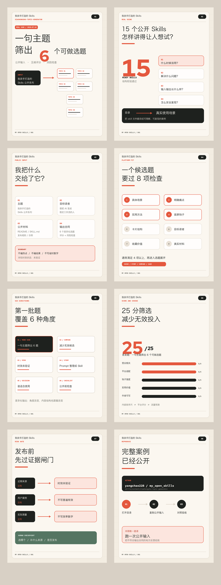

# 小红书图文稿：一句主题，筛出 6 个可做选题

## 已渲染预览

- [01 封面](assets/01-cover.png)
- [02 真实场景](assets/02-scene.png)
- [03 公开输入](assets/03-input.png)
- [04 平台筛选](assets/04-filter.png)
- [05 六类选题](assets/05-topics.png)
- [06 五维评分](assets/06-score.png)
- [07 风险检查](assets/07-risk.png)
- [08 复现入口](assets/08-reproduce.png)

## 画面规格

- 尺寸：1080 × 1440，3:4 竖版
- 页数：8 页
- 首期工作风格：米白底、深灰字、番茄红标注，搭配等宽字体、文件卡片和流程箭头
- 固定角标：`我亲手打造的 Skills · 01`
- 可用证据：公开 README、`SKILL.md` 局部、Case Pack 输入与输出；截图不得出现本地路径和私有上下文

## 第 1 页：封面

**主标题**

一句主题 
筛出 6 个可做选题

**副标题**

我用自己写的 `xiaohongshu-topic-generator` 
做了一次真实选题

**视觉建议**

中央放一张 `SKILL.md` 文件卡，左侧是一张主题输入卡，右侧散开 6 张候选题便签。

## 第 2 页：真实场景

**标题**

15 个公开 Skills，直接逐个介绍会发生什么？

**正文**

仓库里已经有 15 个 `ready` skills。

如果按功能逐个介绍，很容易变成产品目录。读者仍然不知道：

- 什么时候该用
- 它解决什么具体问题
- 它和普通 Prompt 有什么差别
- 为什么值得进入自己的工作流

所以第一期先处理一个真实问题：把技能清单翻译成使用场景。

**视觉建议**

左边画仓库目录，右边画具体读者场景，中间标注：`Skill 文件 → 可理解、可复现的内容选题`。

## 第 3 页：公开输入

**标题**

我把什么交给了它？

**正文**

**主题** 
我亲手打造的 Skills

**目标读者** 
想把 AI 变成稳定工作流的人

**真实材料** 
公开仓库 README、Skill 说明和发布规则

**输出格式** 
6 个差异化图文选题

**明确禁区**

- 不编近期热点
- 不编用户使用结果
- 不写未测量的省时数字
- 不使用“爆款”“人人都在用”等表述

本轮没有近期平台来源，统一标注：**时效未验证**。

**视觉建议**

做成一张“公开选题任务单”，禁区使用红色警示标签。

## 第 4 页：筛选方法

**标题**

一个候选题要过哪些检查？

**正文**

这个 Skill 会先检查：

- 有没有具体场景
- 痛点或问题是否明确
- 读者能否带走方法或清单
- 第一屏有没有清晰钩子
- 能否拆成卡片结构
- 目标读者是否具体
- 有没有收藏和复用价值
- 作者手里有没有真实材料

通常至少满足其中 4 项，才继续展开。

它还会主动拉开角度：教程、故事、对比、决策、风险边界、迷你案例。

**视觉建议**

用八格检查盘表现平台适配，旁边放六种内容类型卡。

## 第 5 页：第一批选题

**标题**

这次生成的 6 个方向

**正文**

1. Mini case：一句主题怎样筛出 6 个可做选题
2. 误区对比：选题 Skill 为什么要帮人减少无效题
3. 风险边界：没有当前来源，就写“时效未验证”
4. 个人经历：为什么把常用 Prompt 整理成公开 Skill
5. 适用人群：谁适合用，谁会失望
6. 公开流程：一个私人 workflow 公开前要过哪些检查

六个方向覆盖不同内容类型，没有把同一句话改写六遍。

**视觉建议**

六张错落卡片，每张只标内容类型和一句话方向，不使用播放量或增长图标。

## 第 6 页：评分与选择

**标题**

我用 25 分筛选，减少无效投入

**正文**

五个评分维度：

受众相关度 / 平台适配度 / 钩子强度 / 实用价值 / 作者可写性

- 一句主题筛出 6 个可做选题：**25 分｜优先做**
- 时效未验证这道证据闸门：**24 分｜优先做**
- 谁适合使用这个 Skill：**24 分｜优先做**
- 如何减少无效题：**24 分｜优先做**
- Prompt 如何整理成 Skill：**22 分｜可备选**
- 公开前检查流程：**22 分｜可备选**

我选第一项做首期，因为输入、处理、输出和边界都能公开复现。

**脚注**

这是内部内容排序尺，不代表平台评分或流量预测。

**视觉建议**

横向评分条配两档结论标签，底部突出首发选择理由。

## 第 7 页：风险检查

**标题**

发布前，它还要先挑刺

**正文**

**没有近期来源** 
不写“最近爆火”，标注时效未验证。

**没有公开用户案例** 
不写“很多人用了都有效”。

**没有实际测量** 
不写“效率提升 X%”或“节省 X 小时”。

**能力边界要说清楚** 
它生成选题、钩子、卡片框架、评分和风险检查。

最终选哪个、补什么来源、是否发布，仍然由人决定。

**视觉建议**

做成发布前检查清单，底部盖章：`保留人的判断`。

## 第 8 页：复现入口

**标题**

这次案例已经完整公开

**正文**

仓库：`yangchao228/my_open_skills`

Skill：`xiaohongshu-topic-generator`

公开内容包括：

- 完整输入
- 6 个候选题
- 五维评分
- 风险检查
- 复现验收条件

**唯一 CTA**

在 GitHub 找到仓库，复制公开输入跑一次。 
把不符合输出合同的地方反馈给我。

**视觉建议**

用仓库名、Skill 路径和三步复现流程收尾：`打开目录 → 复制输入 → 对照验收`。

## 发布正文

我准备把这个公开 Skills 库，慢慢讲成一个「我亲手打造的 Skills」系列。

第一期，我让自己写的 `xiaohongshu-topic-generator` 直接参与选题。

输入包括主题、目标读者、真实公开材料、图文格式和明确禁区。它会把大主题拆成具体场景和不同内容类型，为候选题准备标题、第一句、卡片框架和视觉建议，再按受众相关度、平台适配度、钩子强度、实用价值和作者可写性进行 25 分排序。

这轮只使用公开仓库材料，没有近期平台数据，也没有用户效果数据。因此所有候选题都标注“时效未验证”，同时排除爆款、涨粉和具体效率提升等主张。

第一批结果覆盖 mini case、误区对比、风险边界、个人经历、适用人群和公开流程。我最后选择“一句主题筛出 6 个可做选题”作为第 1 期，因为整个过程都能公开复现。

这也是这个系列接下来的固定结构：真实问题、公开输入、实际输出、设计判断、能力边界和复现入口。

仓库：`yangchao228/my_open_skills` 
Skill：`xiaohongshu-topic-generator`

本期只留一个邀请：复制仓库里的公开输入跑一次，把不符合输出合同的地方反馈给我。

## 标签

`#我亲手打造的Skills` `#AIAgent` `#AgentSkills` `#AI工作流` `#开源项目` `#内容创作` `#小红书选题`
