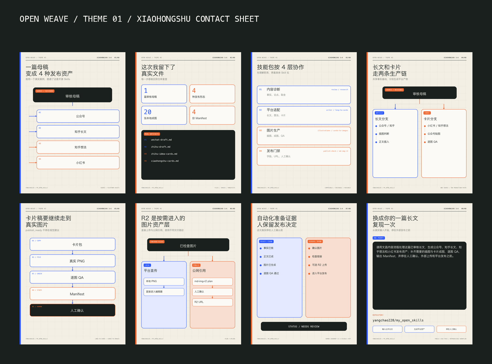

# 小红书图文稿：一篇母稿，变成 4 种发布资产

## 卡片规格

- 页数：8 页
- 尺寸：1080 × 1440，3:4
- `delivery_mode`：`publish_ready`
- `platform_profile`：`xiaohongshu`
- `asset_url_policy`：`local`，平台发布时人工上传本地 PNG
- 目标读者：已有长文、报告、复盘或课程材料，希望沉淀跨平台内容资产的人
- 叙事：真实结果 → 资产证据 → 四层技能结构 → 两条生产链 → 卡片成图 → 图片引用 → 人工门禁 → 复现入口
- 视觉体系：[Open Weave](visual-philosophy.md)

## 已渲染成图

- [第 1 页：四种发布资产](assets/01-cover.png)
- [第 2 页：真实文件](assets/02-real-input.png)
- [第 3 页：四层协作](assets/03-four-layers.png)
- [第 4 页：两条生产链](assets/04-diagnose.png)
- [第 5 页：卡片成图链](assets/05-platform-split.png)
- [第 6 页：R2 条件分支](assets/06-r2-assets.png)
- [第 7 页：人工门禁](assets/07-human-gate.png)
- [第 8 页：复现入口](assets/08-reproduce.png)

## 第 1 页：一篇母稿，变成 4 种发布资产

- 核心信息：同一篇审核母稿分别形成公众号长文、知乎长文、知乎想法和小红书图文。
- 视觉证据：母稿文件连接四类平台资产，不再用固定 Skill 数量作为封面卖点。
- ALT：一篇审核母稿连接公众号、知乎长文、知乎想法和小红书四种发布资产。

## 第 2 页：这次我留下了真实文件

- 核心信息：本案例留下 1 篇审核母稿、4 种发布形态、20 张本地成图和 4 份 Manifest。
- 真实正文：`wechat-draft.md`、`zhihu-draft.md`、`zhihu-idea-cards.md`、`xiaohongshu-cards.md`。
- 图片组成：公众号长文插图 2 张、知乎长文插图 2 张、公众号贴图 3 张、知乎想法 5 张、小红书 8 张。
- ALT：真实案例资产包括审核母稿、四种发布形态、二十张本地成图和四份 Manifest。

## 第 3 页：技能包按 4 层协作

- 内容诊断：事实、论点与材料取舍。
- 平台适配：长文、知乎想法与卡片叙事。
- 图片生产：长文插图、卡片成图与逐图 QA。
- 发布门禁：标题、摘要、标签、URL 状态和人工确认。
- ALT：内容技能包按内容诊断、平台适配、图片生产和发布门禁四层协作。

## 第 4 页：长文和卡片走两条生产链

- 长文分支：公众号与知乎长文先判断插图，再生成本地图片并插入正文。
- 卡片分支：小红书、知乎想法和公众号贴图共用 `long-to-cards → cards-to-images`。
- 共同基线：事实、核心判断和 CTA 来自同一份审核材料。
- ALT：审核母稿分别进入长文插图分支和卡片成图分支。

## 第 5 页：卡片稿要继续走到真实图片

- 完整链路：卡片包 → 真实 PNG → 逐图 QA → Cards Manifest → 人工确认。
- 状态边界：`publish_ready` 不在文案或视觉建议阶段停止。
- ALT：卡片包继续生成真实 PNG、完成逐图检查并写入 Manifest，最后进入人工确认。

## 第 6 页：R2 是按需进入的图片资产层

- 平台直传：保留本地 PNG，直接进入平台编辑器。
- 公网引用：运行 `md-img-r2` plan，检查后由人决定是否上传并获得 R2 URL。
- 安全口径：dry-run 计划不代表上传完成。
- ALT：已检查图片可以直接上传平台，需要公网引用时再进入 R2 计划和人工确认。

## 第 7 页：自动化准备证据，人保留发布决定

- 已完成：事实核验、平台正文、本地图片、逐图 QA。
- 待判断：确认图片、检查发布当天链接、确认长文插图 R2 上传、进入外部平台发布。
- 当前状态：`needs_review`。
- ALT：自动化已准备内容与图片证据，图片确认、外部上传和平台发布仍由人决定。

## 第 8 页：换成你的一篇长文，复现一次

- 仓库：`yangchao228/my_open_skills`
- 完整提示词：

  > 请用文昌内容流程处理这篇已审核长文，生成公众号、知乎长文、知乎想法和小红书发布资产；补齐需要的插图与卡片成图，逐图 QA，输出 Manifest，并停在人工确认、外部上传和平台发布之前。

- ALT：公开仓库、完整复现提示词和三个执行阶段。

## 发布正文

我最近用一篇已经完成事实核验的公开长文，把自己的内容 Skills 技能包完整跑了一遍。

这次没有停在“生成几份平台文案”。公众号和知乎分别形成长文正文与插图；小红书、公众号贴图和知乎想法进入共享卡片链，继续生成真实图片、逐张 QA 和 Manifest。

最后留下了四种发布形态：公众号长文、知乎长文、知乎想法和小红书图文。仓库里可以直接看到 20 张本地成图、4 份 Manifest、图片状态与人工门禁。

图片交付也保留两条路径：平台支持直接上传时使用本地 PNG；需要公开引用、博客复用或长期归档时，再进入 `md-img-r2` dry-run 和人工确认。

我想开源的是一套可以检查、替换和复现的内容生产资料。事实、正文、图片、状态都能留下来，最终角度、外部上传和平台发布继续由人决定。

仓库：`yangchao228/my_open_skills`

如果你手上已经有一篇长文，最想先复用这条链路里的哪一步？

## 标签

- `core_tags`：`#AIAgent` `#AI工作流` `#内容创作`
- `scene_tags`：`#多平台内容分发` `#知识管理` `#数字资产`
- `series_tags`：`#我亲手打造的Skills` `#开源项目`
- `verified_hot_tags`：`unverified`，发布当天需要时再核验并记录来源与时间

## Image Production Handoff

- Next skill：`wenchang-publish-check` final mode
- Cards Manifest：[xiaohongshu-upload-manifest.md](xiaohongshu-upload-manifest.md)
- 生成状态：8 张 `generated`
- 逐图 QA：8 张 `passed`
- 人工确认：`pending`
- R2 状态：`not_planned`；小红书图文使用本地 PNG 人工上传
