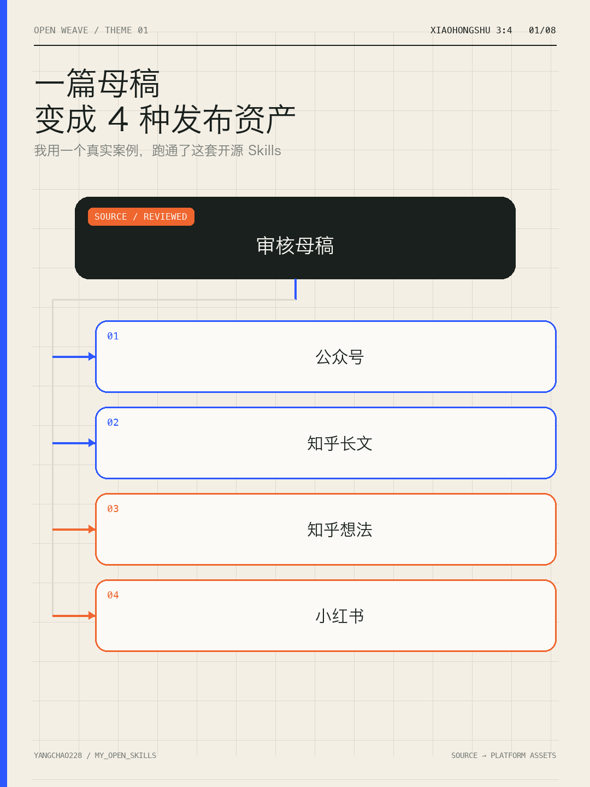
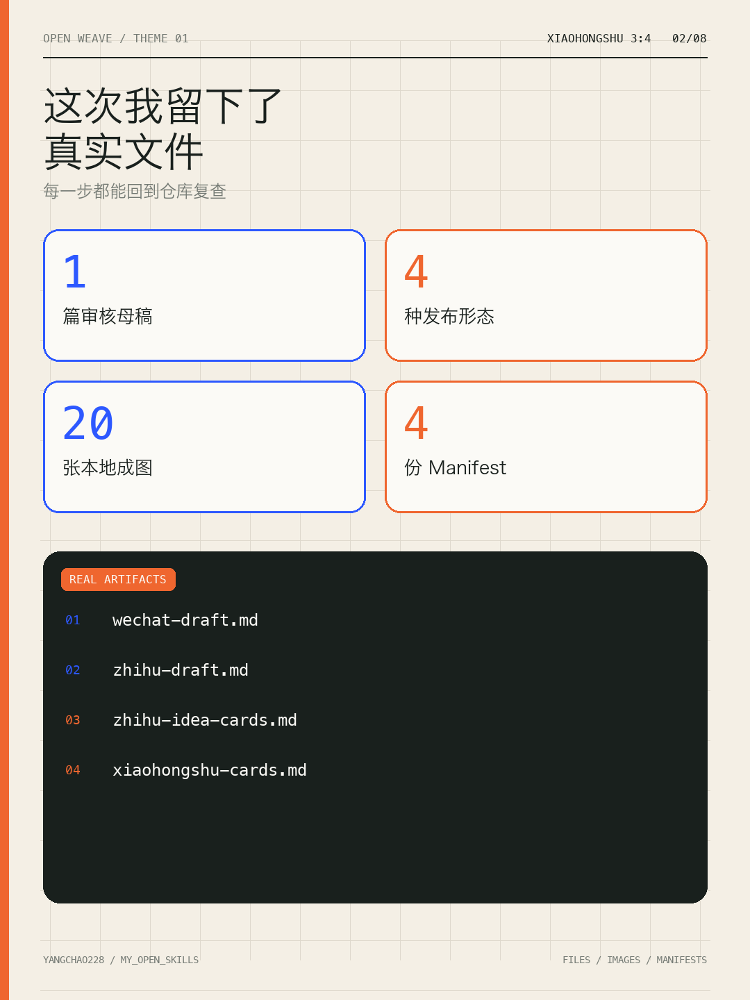
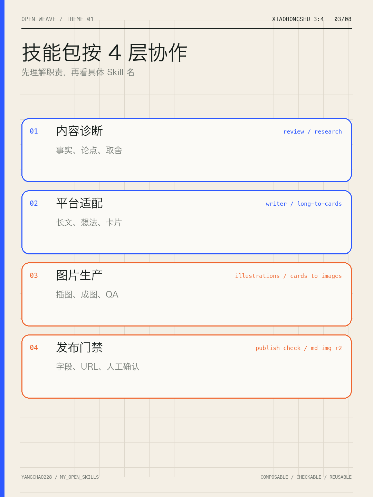
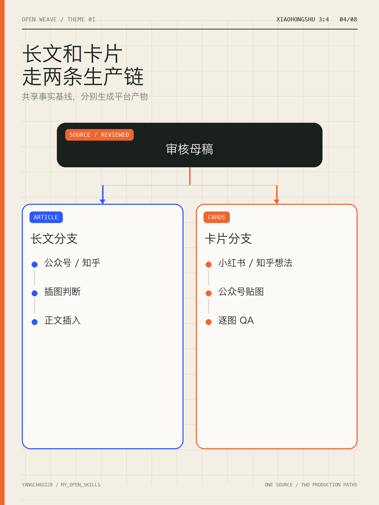
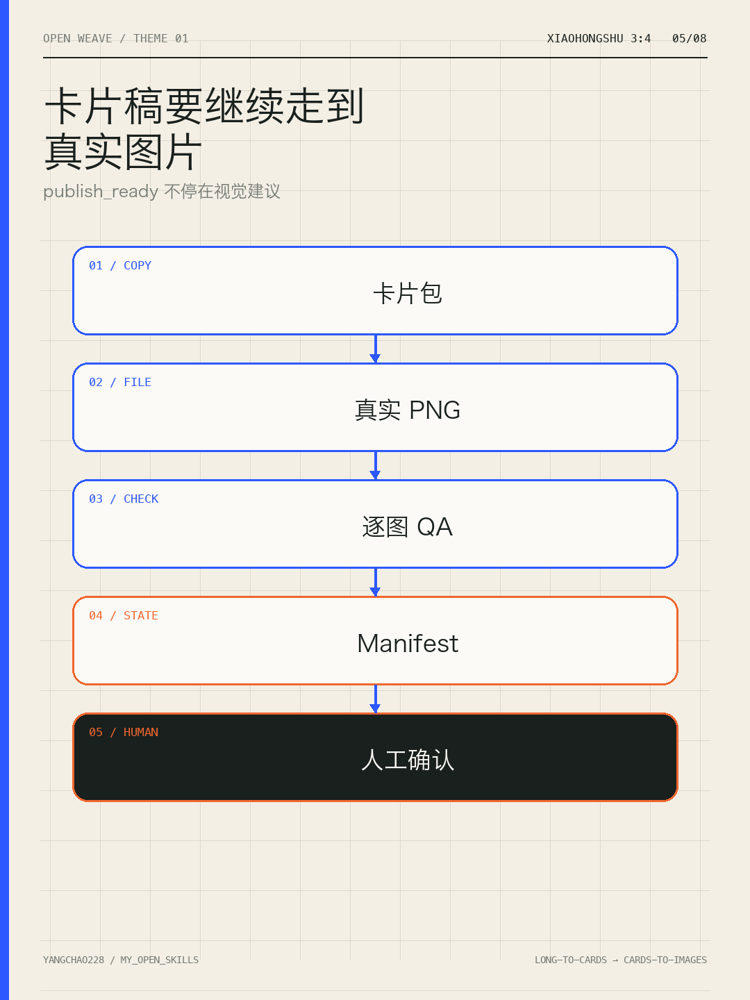
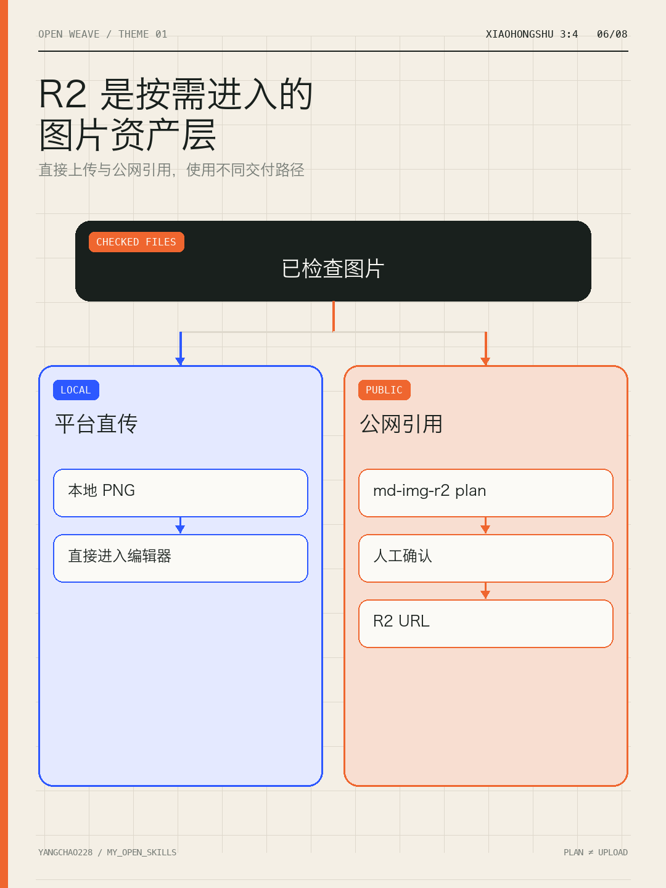
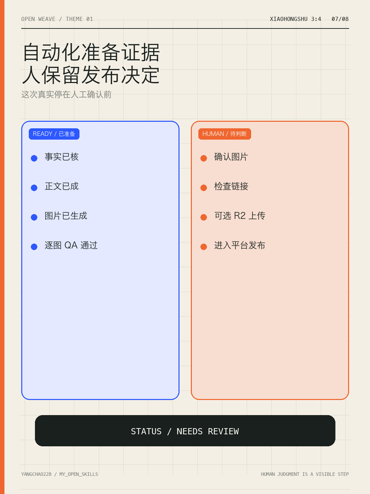
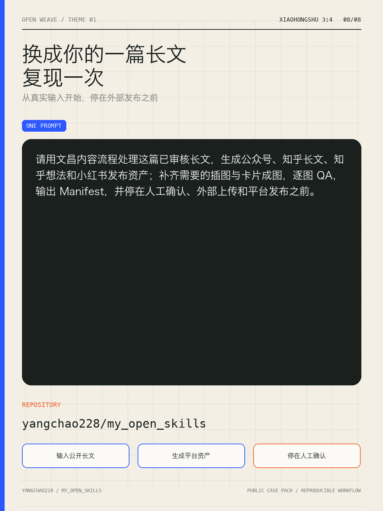

# 主题 01：小红书 Cards Manifest 与上传清单

本文件记录重构后的 8 张宣传卡，作为小红书平台的本地上传清单。

- `delivery_mode`：`publish_ready`
- `platform_profile`：`xiaohongshu`
- `asset_url_policy`：`local`，小红书发布时人工上传本地 PNG
- 生成状态：8 张均为 `generated`
- 视觉检查：8 张均为 `passed`，已逐张打开检查
- 人工确认：`pending`
- R2 状态：`not_planned`；历史 dry-run 仅保留为工作流验证证据，不进入本次发布

## Cards Manifest

| card_id | source_card | local_path | format | width | height | alt_text | render_strategy | generation_status | visual_qa_status | human_confirmation | asset_url_policy | r2_state | public_url |
| --- | --- | --- | --- | ---: | ---: | --- | --- | --- | --- | --- | --- | --- | --- |
| CARD-01 | 四种发布资产 | `assets/01-cover.png` | PNG | 1080 | 1440 | 一篇审核母稿连接公众号、知乎长文、知乎想法和小红书四种发布资产 | deterministic | generated | passed | pending | local | not_planned | n/a |
| CARD-02 | 真实文件 | `assets/02-real-input.png` | PNG | 1080 | 1440 | 真实案例资产包括审核母稿、四种发布形态、二十张本地成图和四份 Manifest | deterministic | generated | passed | pending | local | not_planned | n/a |
| CARD-03 | 四层协作 | `assets/03-four-layers.png` | PNG | 1080 | 1440 | 内容技能包按内容诊断、平台适配、图片生产和发布门禁四层协作 | deterministic | generated | passed | pending | local | not_planned | n/a |
| CARD-04 | 两条生产链 | `assets/04-diagnose.png` | PNG | 1080 | 1440 | 审核母稿分别进入长文插图分支和卡片成图分支 | deterministic | generated | passed | pending | local | not_planned | n/a |
| CARD-05 | 卡片成图链 | `assets/05-platform-split.png` | PNG | 1080 | 1440 | 卡片包继续生成真实 PNG、逐图检查和 Manifest，再进入人工确认 | deterministic | generated | passed | pending | local | not_planned | n/a |
| CARD-06 | R2 条件分支 | `assets/06-r2-assets.png` | PNG | 1080 | 1440 | 已检查图片可以直接上传平台，需要公网引用时再进入 R2 计划和人工确认 | deterministic | generated | passed | pending | local | not_planned | n/a |
| CARD-07 | 人工门禁 | `assets/07-human-gate.png` | PNG | 1080 | 1440 | 自动化已准备内容与图片证据，外部上传和平台发布仍由人决定 | deterministic | generated | passed | pending | local | not_planned | n/a |
| CARD-08 | 复现入口 | `assets/08-reproduce.png` | PNG | 1080 | 1440 | 公开仓库、完整复现提示词和三个执行阶段 | deterministic | generated | passed | pending | local | not_planned | n/a |

## 本地上传顺序

按下列顺序在小红书编辑器中人工上传，不执行 R2 上传或 URL 替换。

