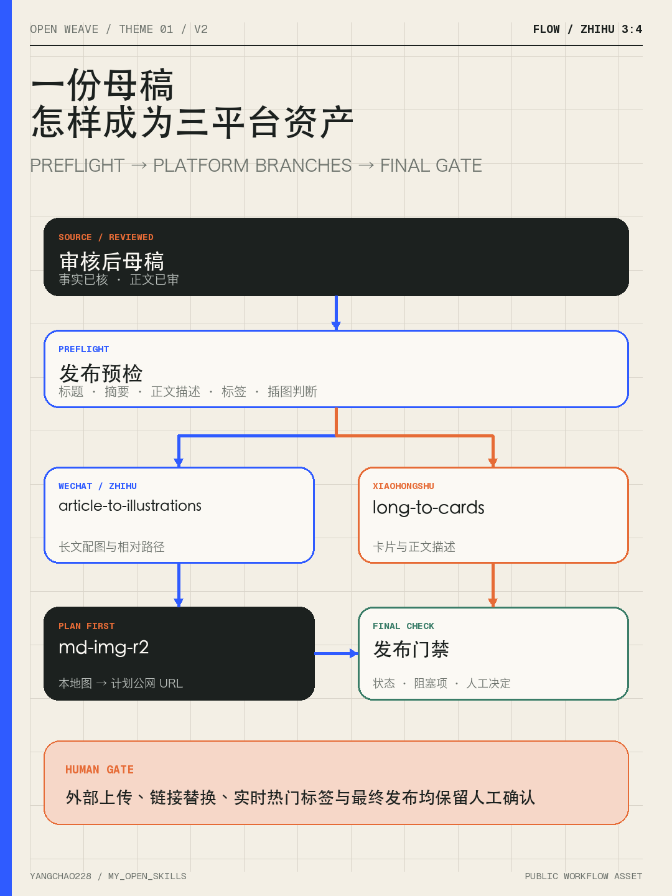
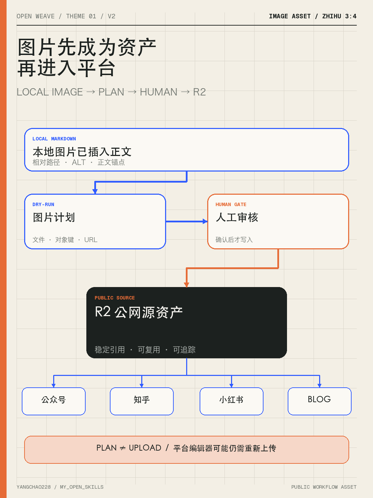

# 一篇已经写完的长文，怎样被 7 个 Skills 拆成知乎、小红书和发布包？

> 我亲手打造的 Skills · 主题 01

> 版本说明：本文保留主题 01 原始“7 个 Skills”案例叙事。当前流程在长文发布环节新增 `article-to-illustrations`，在卡片发布环节新增 `cards-to-images`，并已补齐公众号贴图与知乎想法真实产物；最新回归与发布门禁见 [V2 回归](workflow-v2-regression.md)。

我在公开构建 `my_open_skills` 时，想验证一件事：一组 Skill 能否把一篇已经成形的长文，拆成不同平台真正能使用的内容资产。

这次我选了一篇公开的《Loop Engineering 从入门到进阶手册》介绍稿作为真实输入。它只承担案例输入的角色。我要展示的对象，是这套内容技能包如何处理一篇长文：先判断哪些材料值得保留，再为知乎和小红书选择不同入口，最后检查图片交付与发布条件。

最终沉淀下来的并非一份“万能改写结果”，而是一套可以检查、替换和复用的过程资产。

## 一篇长文跨平台，真正缺的是什么

长文写完后，常见做法是改个标题、压缩几段，然后分发到其他平台。

这样做会留下几个问题：

- 原文哪些判断、案例和数字可以安全复用？
- 知乎需要展开哪个问题，读者才有讨论空间？
- 小红书应该从哪个具体场景进入，才能拆成可保存的卡片？
- 原文里的图片能否直接使用，是否还存在本地文件或链接失效问题？
- 发布前的链接、CTA、配图和能力边界由谁检查？

这些问题来自不同阶段，交给一条大 Prompt 往往会混在一起。输出看起来完整，过程却很难检查。我的做法是把每一段判断拆给职责明确的 Skill，并把中间产物留下来。

## 这次实际用了 7 个 Skills

原案例的 7 个 Skills 仍作为历史运行事实保留。V2 新增 `article-to-illustrations`，将公众号和知乎的插图判断、正文锚点与图片 manifest 单独管理。

后续补充的 publish-ready 卡片合同要求 `long-to-cards` 继续进入 `cards-to-images`，直到真实图片、逐图 QA 和 cards manifest 齐全。下图保留 V2 长文插图回归状态，最新卡片交接见 [完整回归记录](workflow-v2-regression.md)。



| 阶段 | Skill | 这次具体完成什么 |
| --- | --- | --- |
| 源文诊断 | `wenchang-review` | 提取核心判断、可复用案例与不适合公开复用的材料 |
| 知乎切入 | `zhihu-topic-hunter` | 把长文转成“为什么需要这样设计”的讨论问题 |
| 小红书切入 | `xiaohongshu-topic-generator` | 把长文转成具体场景、首屏钩子和 8 页卡片叙事 |
| 通用卡片化 | `long-to-cards` | 让每张卡只承载一个判断，并给出视觉结构 |
| 公众号分发 | `wechat-to-cards` | 为原长文保留可插入的机制图和分发摘要路径 |
| 图片状态 | `md-img-r2` | 把本地图片接入 R2 公网引用，并检查现有图片是否需要处理 |
| 发布检查 | `wenchang-publish-check` | 汇总标题、摘要、标签、链接、CTA 与视觉验收条件 |

这不是为了堆 Skill 名称。每个环节都有清晰输入、预期输出和停止点，任何一步出问题都能定位，也能替换成自己的流程。

## 第一段：先做源文诊断，决定什么该留下

这份长文的核心材料包括任务分层、四个 Loop 条件、CI 自动修复和 UI 精准复刻两个案例，以及人工确认边界。

有些内容不进入跨平台稿：私信领取方式、作者身份转化话术、容易过期的版本数字。它们对原文有作用，对公开案例的复现没有帮助。

诊断结果被记录在 Case Pack 里，而非藏在一次对话中。后续写知乎、拆小红书、做发布检查时，都可以回到同一份材料确认边界。

## 第二段：同一篇源文，平台入口需要重新选择

知乎稿从一个判断问题进入：为什么 AI Agent 进入真实工作后，反馈、停止与验收会变成关键设计？它保留任务分层和两个案例，给读者完整的推理路径。

小红书稿从一个工作场景进入：AI Agent 已经开始重复做事，你每轮仍要重新解释、检查和兜底。随后用八页卡片展示任务层级、四个条件、两类反馈和人工边界。

源文的论点没有变化，阅读路径变了。这正是平台适配 Skill 需要完成的判断。

## 第三段：图片环节也要留下状态



很多内容流程在最后一步才发现图片无法使用：文章引用的是本地路径，外链不稳定，或者替换 URL 时误改了正文。

因此我把 `md-img-r2` 放进这条链路。它默认只生成图片状态计划，只有明确确认后才会上传或改写 Markdown。

这次输入里的 3 张图片已经通过 R2 公网域名引用，所以实际结果是“0 张本地图片需要处理”。这些地址可以继续作为公众号、知乎长文和博客的稳定引用。小红书、知乎想法和公众号贴图使用本地 PNG 人工上传。

## 第四段：把最终判断留给人

这组 Skills 可以准备素材、形成草稿、标记风险、生成卡片结构和发布检查表。

最终是否采用某个切入角度、图示是否准确、链接在发布当天是否仍可访问、内容要不要进入外部平台，仍由人决定。涉及生产配置、数据删除、权限调整和公开发布时，人工确认点会保留在流程中。

这是我希望这套 Skills 具备的形态：帮助人减少重复组织工作，同时让关键判断可见、可修改、可交接。

## 这次真正公开了什么

我没有只交付一篇文章，而是把这条内容链路整理成了一组公开资产：

- [主题 01 Case Pack](https://github.com/yangchao228/my_open_skills/tree/main/docs/series/handcrafted-skills/themes/01-content-asset-pipeline)：源文诊断、事实确认、复现路径和边界
- [知乎稿](https://github.com/yangchao228/my_open_skills/blob/main/docs/series/handcrafted-skills/themes/01-content-asset-pipeline/zhihu-draft.md)：保留论证空间的平台版本
- [小红书卡片稿](https://github.com/yangchao228/my_open_skills/blob/main/docs/series/handcrafted-skills/themes/01-content-asset-pipeline/xiaohongshu-cards.md)：8 页场景化卡片脚本
- [公众号贴图包](https://github.com/yangchao228/my_open_skills/blob/main/docs/series/handcrafted-skills/themes/01-content-asset-pipeline/wechat-inline-cards.md)：3 张 1600×900 贴图及 Manifest
- [知乎想法图文包](https://github.com/yangchao228/my_open_skills/blob/main/docs/series/handcrafted-skills/themes/01-content-asset-pipeline/zhihu-idea-cards.md)：正文、5 张配图及 Manifest
- [发布前检查](https://github.com/yangchao228/my_open_skills/blob/main/docs/series/handcrafted-skills/themes/01-content-asset-pipeline/publish-check.md)：标题、摘要、标签、图片计划和人工验收条件

加上公众号与知乎长文中的 4 张正式插图，当前案例共有 20 张正式本地成图和 4 份 Manifest。三组卡片图片已通过逐图 QA，人工确认与外部发布仍保持为可见门禁。

你也可以换成自己的公开文章或已授权材料，沿着同样的路径跑一遍：

```text
源文诊断 → 平台入口 → 卡片脚本 → 图片状态 → 发布检查
```

**本期只留一个邀请：从仓库选择一篇你自己的公开长文，复现这条内容链路，并反馈哪一步最值得保留或改造。**
